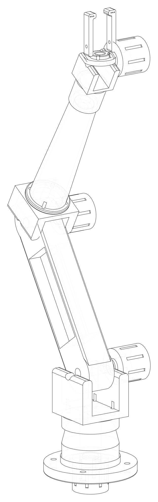
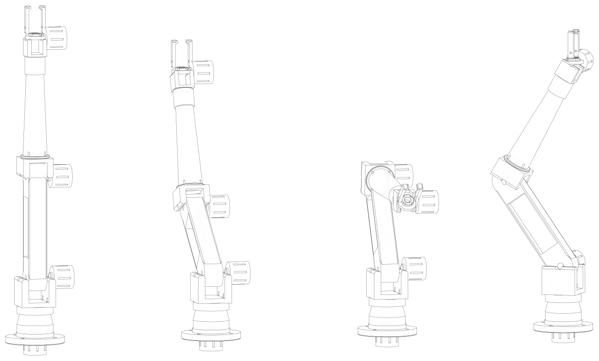
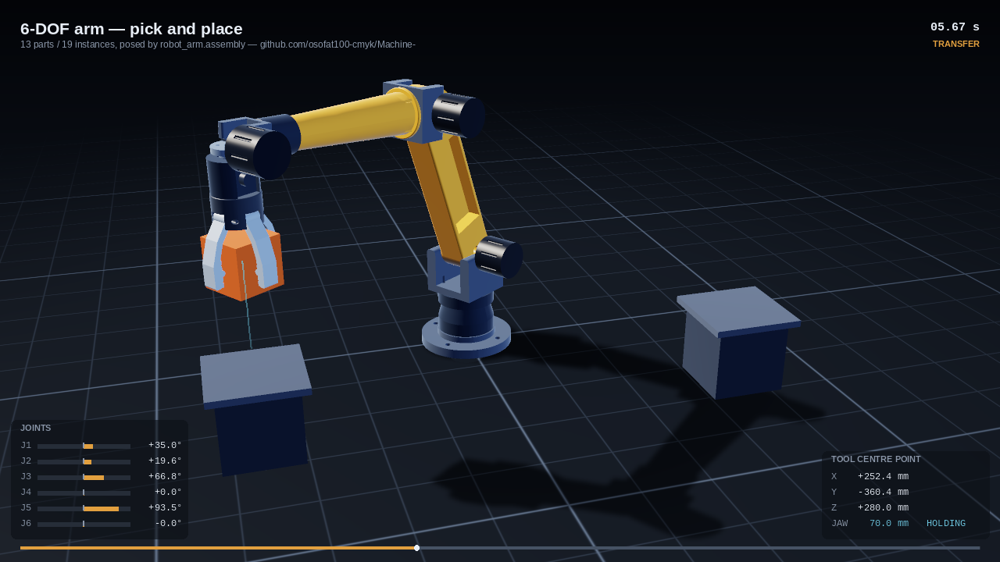
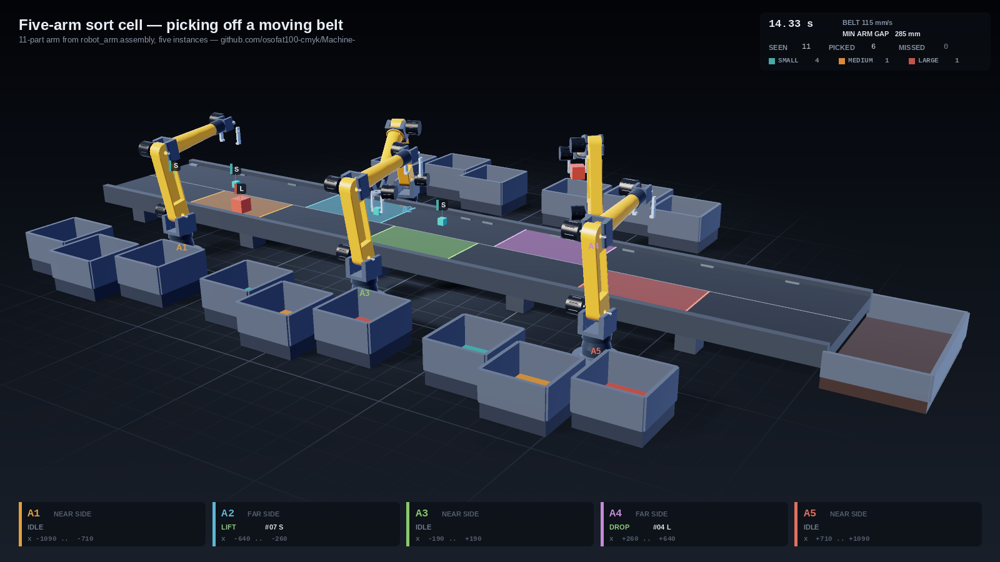

# Machine-

How to build a mechatronics machine with Claude.

---

## Can an agent generate a robot arm in CAD from one prompt?

This repository answers that question, prompted by a MecAgent post
claiming one prompt, 11 parts, 1 assembly, 35 minutes, in SolidWorks
2026.

**Read the answer: [`docs/can-claude-do-this.md`](docs/can-claude-do-this.md)**



Twelve parts, sixteen instances, one assembly. 6061-T6, 573 mm reach
in the default build, verified in seconds.

## Two halves

### `cad/` — runs here, right now

A parametric 6-DOF arm on an OpenCascade kernel. No SolidWorks, no
licence, no GUI.

```bash
pip install build123d
cd cad && python3 build.py
```

Exports STEP, STL and hidden-line drawings, and refuses to export
anything that fails its eleven verification checks — including a
kinematic chain cross-checked against an independent 4×4-matrix
implementation, agreeing to 2.6e-13 mm.



*Only the six joint angles change between these. No geometry is rebuilt.*

#### And it moves



```bash
cd cad && python3 simulate.py          # build/machine.mp4
```

A 13.7-second pick-and-place cycle, rendered from the same eleven solids.
The pose comes from an inverse solve that runs once per frame on the
straight-line moves; the placements are read out of `build_assembly`
itself, so the arm in the video and the arm in the STEP file cannot
disagree about where a joint is. Thirteen checks run before a frame is
drawn — including the model's own interference check, re-run at every
pose the program commands — and the render is refused if any fails.

Software-rasterised in numpy: no GPU, no OpenGL, no display. See
[`cad/sim/`](cad/sim/README.md).

#### And five of them run a line



```bash
cd cad && python3 simulate_cell.py     # build/cell.mp4
```

Five instances of the same arm -- re-driven longer, 728 mm of reach --
beside a belt that never stops, sorting boxes by size into fifteen bins.
Three on one side, two on the other, staggered so no two ever look at
the same stretch of belt. Every box is the same colour and the same
shape; the only thing that decides where one goes is its measured edge,
so the sorting is a measurement rather than a colour match.

Each arm can **extend right across** the belt -- that is why the links
are longer -- and is never **sent** across it. Capability and policy are
separate claims and both are checked: the solver is asked for a tool
pose at ninety points spanning the full width, and the dispatcher is
held to each arm's own half.

Territory is the rest of the design: an arm takes a box only if it is on
that arm's half, lands inside that arm's stretch of belt, and sits
inside the annulus the arm can provably reach. A box its owner is too
busy for goes to the next arm on that side; one nobody catches runs off
the end and is counted. And because disjoint territory constrains the
tool but not the elbow, the clearance between every pair of arms is
measured from the placed triangles every frame.

### `fusion360/` — run it in Fusion

The same arm built **inside Fusion**, with a real editable timeline, 33
User Parameters, and 5 revolute joints. Load it from *Scripts and
Add-Ins* and hit Run.

Tested off-Fusion against a fake `adsk` module: 20 tests covering the
script's logic and confirming every dimension matches the verified
`cad/` model. See its [README](fusion360/README.md).

### `solidworks_harness/` — needs your Windows machine

A 20-tool agent surface that drives SolidWorks over COM to produce
**native parts with a real feature tree**, which is the thing a STEP
import cannot give you. Windows-only; the COM layer is written against
the documented API but untested — see its
[README](solidworks_harness/README.md) before running it.

## The short version

The gap between "generates plausible CAD" and "generates CAD an engineer
accepts" is almost entirely the verification loop, not the generation.
Writing checks found three real defects in eleven parts. Rendering the
arm and looking at it found a fourth that every automated check had
passed: a gripper whose jaws opened outward.
